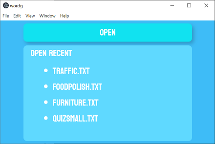

# WORDG

WORDG is application helping users learn foreign language words. The words and answers are read from a text file.

## Table of Contents

- [Features](#features)
- [Screens](#screens)
  - [Open File Screen](#open-file-screen)
  - [Translation Quiz Screen](#translation-quiz-screen)
  - [Correct Guess Screen](#correct-guess-screen)
  - [Incorrect Guess Screen](#incorrect-guess-screen)
  - [Exit Confirmation Screen](#exit-confirmation-screen)
  - [Quiz Completion Screen](#quiz-completion-screen)
- [File Format](#file-format)
- [Getting Started](#getting-started)
  - [Prerequisites](#prerequisites)
  - [Installation](#installation)
- [Usage](#usage)
- [Contributing](#contributing)
- [License](#license)

## Features

- Load words from a text file for the quiz
- Interactive quiz to test your knowledge
- Feedback on correct and incorrect guesses

## Screens

### Open File Screen



This screen allows the user to open and load the text file containing the words for the quiz.

- Open button for opening from file system
- Open recent for opening recent file

### Translation Quiz Screen


This screen presents the user with a word in their native language and asks for the translation in the foreign language.

- Red cross for closing quiz
- Progress of a quiz "answered/all"
- Check button for checking answer

### Correct Answer Screen


If the user guesses the translation correctly, this screen provides positive feedback and presents the next word.

### Incorrect Answer Screen


If the user guesses the translation incorrectly, this screen provides corrective feedback and presents the correct translation.

### Exit Confirmation Screen


This screen asks the user if they want to close quiz.

### Quiz Completion Screen


When the user completes the quiz, this screen is shown.

## File Format

The text file have the following format:

```
kuchnia - kitchen
jedzenie - food
...
```

## Getting Started

### Prerequisites

- Make sure you have [NPM](https://docs.npmjs.com/) installed on your system.

### Installation

1. Clone the repository:
    ```bash
    git clone https://github.com/liscju/wordg
    ```
2. Navigate to the project directory:
    ```bash
    cd wordg
    ```

## Usage

1. Run the application:
    ```bash
    npm start
    ```
2. Follow the on-screen instructions to load the word file and start the quiz.

## Contributing

Contributions are welcome! Please fork the repository and submit a pull request for review.

## License

This project is licensed under the MIT License - see the [LICENSE](LICENSE) file for details.

Project uses open source [Koulen](https://fonts.google.com/specimen/Koulen) font and free icons from [icons8](https://icons8.com/).
